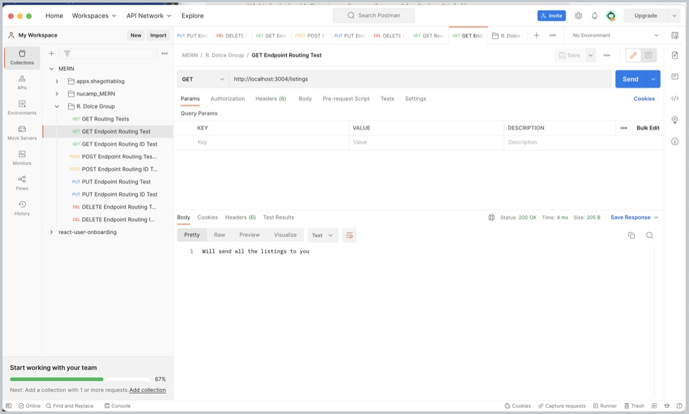
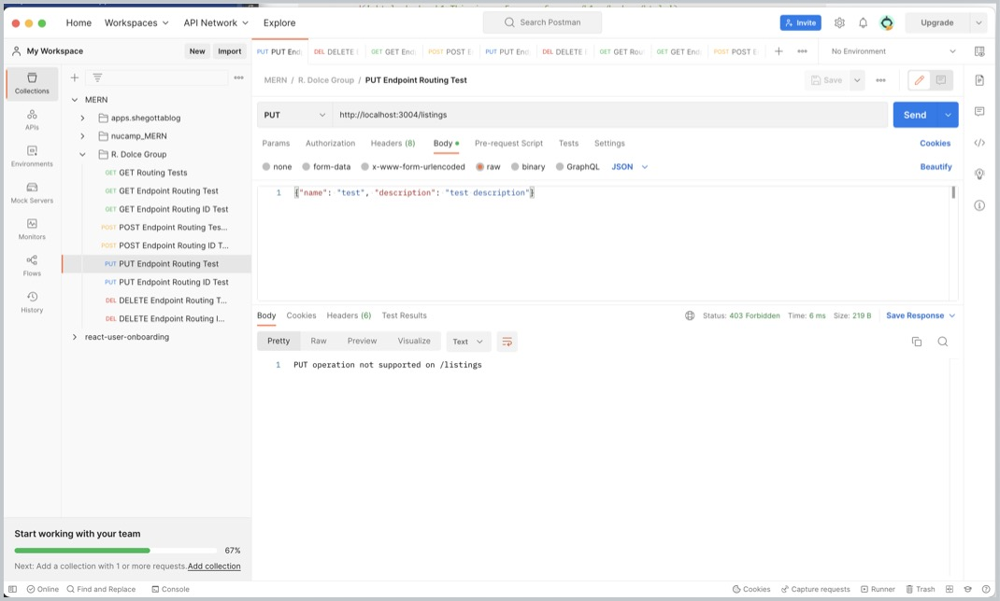
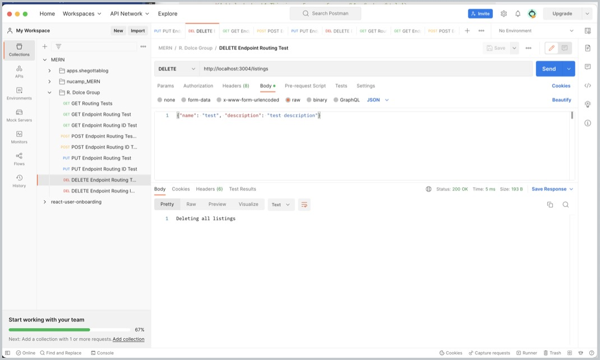
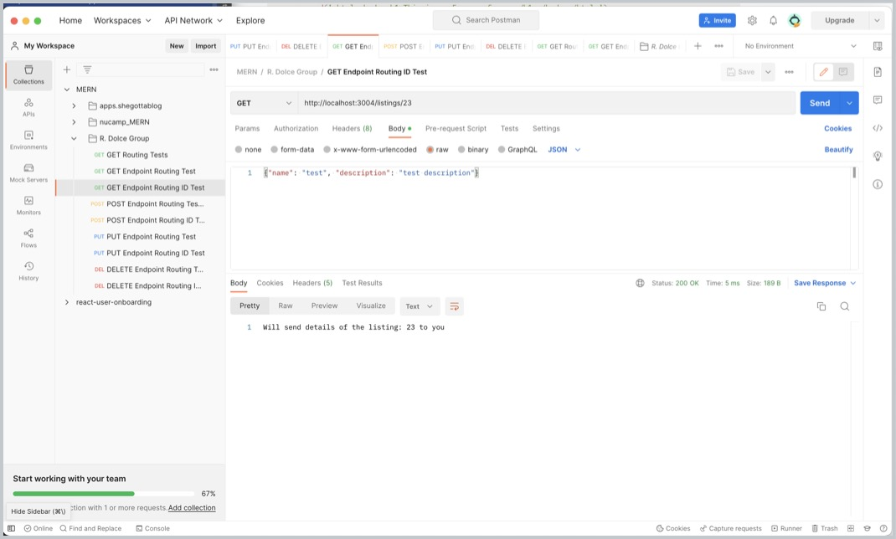
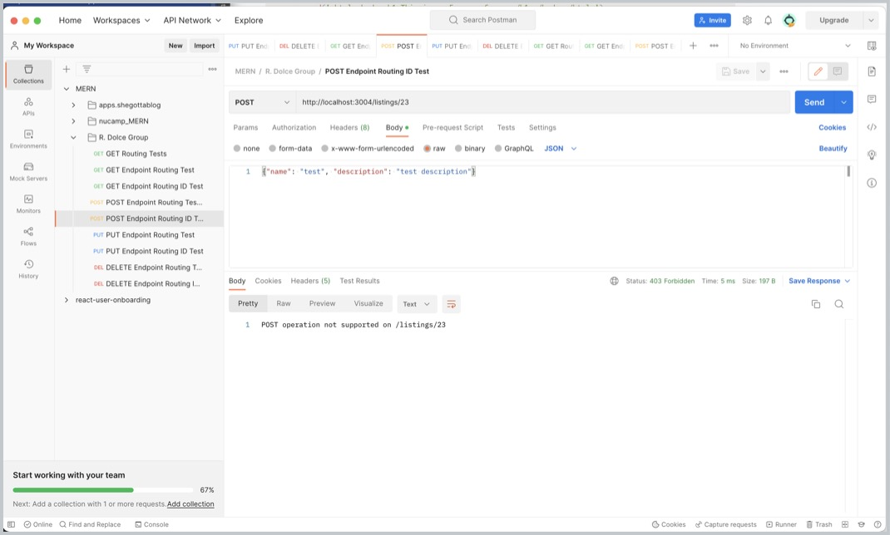
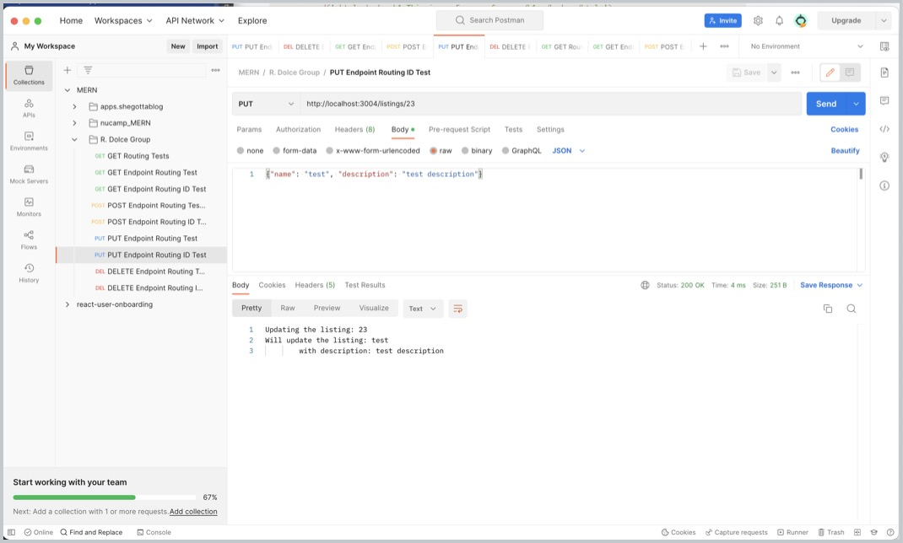
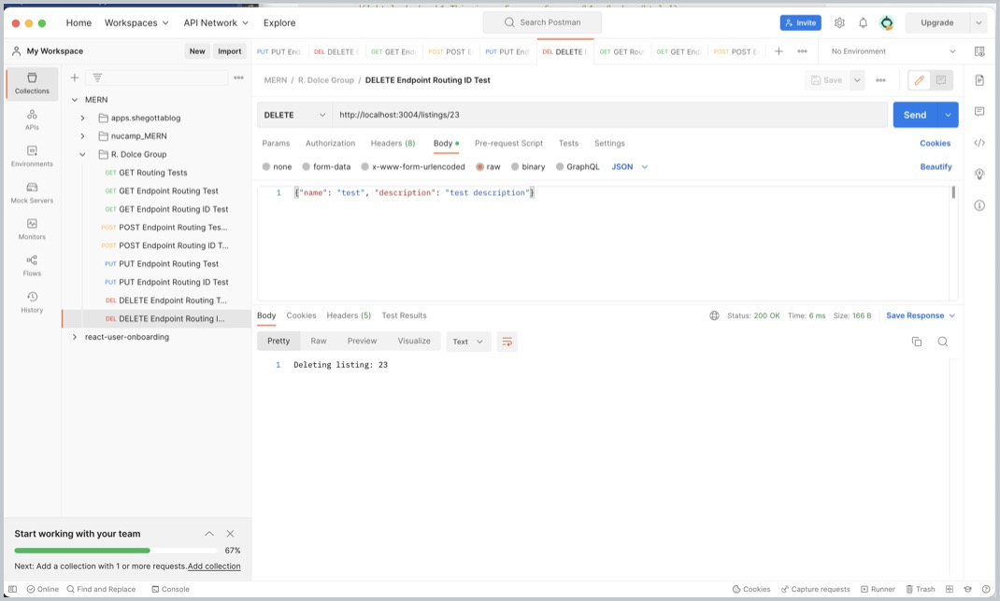

# M.Dolce R. Dolce Group Vacation Rental Listings Demo
- Version 1.0.0
- Last Updated January 11, 2023
- Author: marti@rdolcegroup.com
- Timeline to completion: 20 days
---
Creating a simple MERN Vacation Listings project demonstrating technologies used to build portfolios of technologies learned while attending Nucamp Bootcamp.
When developing this application there were a variety of source codes, tutorials, books and web articles analyzed to explore the most effective way for development of this application on a short scale.

## Key Changes Anticipating Deployment limitations
The site will be setup to use a virtual hosted environment at https://rdolcegroup.localhost:80

## Key Environment Features
A list of packages used in this project.

| Package                              | Description                                          |
|--------------------------------------|------------------------------------------------------|
| `Express`                            | https://www.npmjs.com/package/express                |
| `nodemon `                           | https://www.npmjs.com/package/nodemon                |
| `morgan`                             | https://www.postman.com/downloads/                   |
| `vhost`                              | https://www.npmjs.com/package/express                |
| `Morgan `                            | https://www.npmjs.com/package/morgan                 |
| `Postman Application`                | https://www.postman.com/downloads/                   |

---
## Server Features
[x] - Express Server with Routing and Middleware 01.14.23
[ ] - Integrating MongoDB with Listing data, images, and APIs 01.21.23
[ ] - Adding User Authentication 01.21.23

---
## POSTMAN REST API Testing (GET | POST | PUT | DELETE)
 
The following are screen examples demonstrating the functionality of Express and the built-in express.json() routing features.

| GET                                                                       | POST                                                                       | PUT                                                                        | DELETE                                                                    | 
|---------------------------------------------------------------------------|----------------------------------------------------------------------------|----------------------------------------------------------------------------|---------------------------------------------------------------------------| 
| |  |  | | 
| |  |  | | 

---

## Resources & Inspiration

 
Functional Concepts

> React Navigation | https://reactnavigation.org/docs/getting-started/

> Gatsby plugin for react-native-web | https://www.gatsbyjs.com/plugins/gatsby-plugin-react-native-web/#gatsby-plugin-for-react-native-web

> Const vs Function | https://dev.to/ugglr/react-functional-components-const-vs-function-2kj9

 
Design & UI

> Material Design Icons | https://materialdesignicons.com/

> Adobe Express to create SVG | https://www.adobe.com/express/

